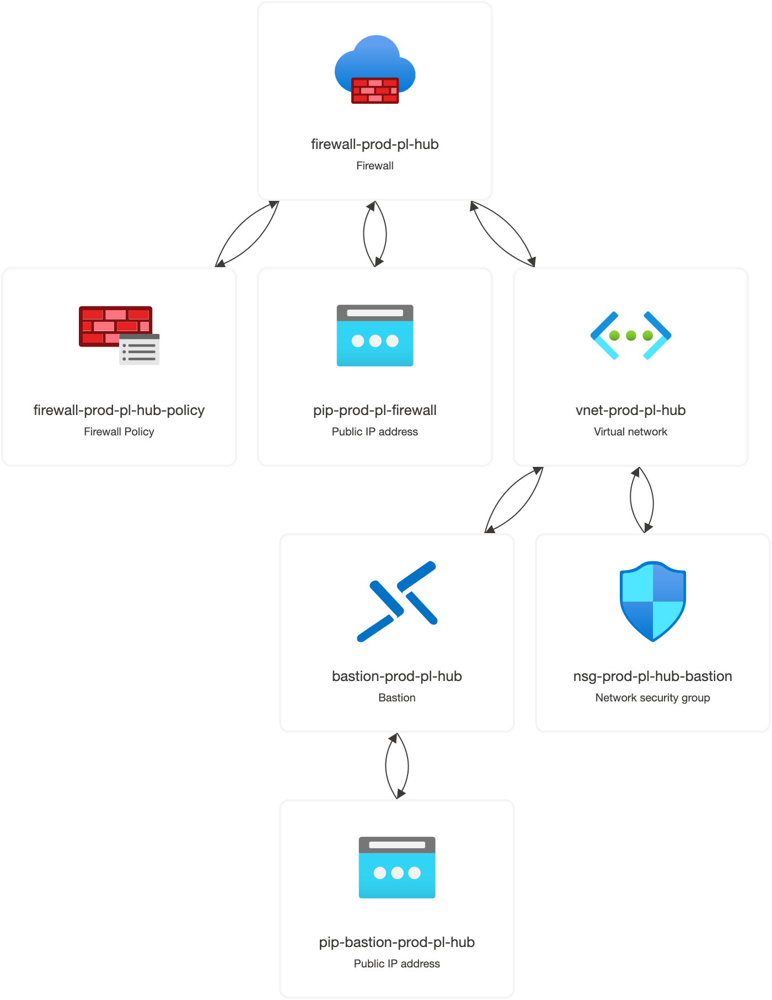
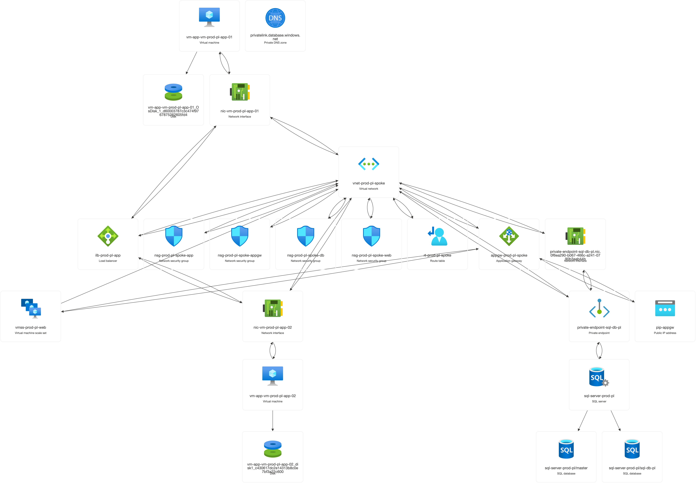

# azure-hub-spoke
A ready-to-deploy lab environment designed to help you ace the AZ-104 certification exam.

## Table of Contents
* [Why this project?](#why-this-project)
* [Conceptual Diagram](#conceptual-diagram)
* [Resource Visualizer (Live Environment)](#resource-visualizer-live-environment)
* [Key Features](#key-features)
* [Network Traffic Flow](#network-traffic-flow)
* [Tech Stack](#tech-stack)
* [Important: Budget Warning](#important-beware-of-your-budget)
* [Prerequisites](#prerequisites)
* [Secrets Management](#secrets-management)
* [Project Structure & Modules](#project-structure--modules)
* [How to Deploy](#how-to-deploy)
* [Customization (Quotas & Sizing)](#customization-regional-quotas--sizing)
* [How to verify the setup](#how-to-verify-the-setup)
* [Optional: Hybrid Connectivity (VPN)](#optional-hybrid-connectivity-vpn)

## Why this project?
I built this infrastructure while preparing for **AZ-104** and learning **Terraform**, mainly to have a place to practice. Now I’m sharing it with the community.

This environment is a sandbox to run exercises, test configurations, and get comfortable with Azure administration in a hands-on way.

The goal is to practice various scenarius, which is helpfull during AZ-104 exam and in real life while working with Azure.

## Conceputal Diagram


### Diagram Legend & Traffic Flows
| flow | description |
| :--- | :--- |
| **continuous green** | **external traffic** – user requests from the internet to the web tier |
| **dashed green** | **internal backend** – load-balanced communication (web to app layers) |
| **dotted teal** | **private link** – isolated sql database connectivity |
| **dashed orange** | **traffic steering** – udr logic routing traffic through azure firewall |
| **continuous orange** | **inspected egress** – filtered outbound traffic to the internet |
| **continuous black** | **management** – secure admin entry points (bastion/vpn) |
| **dashed blue** | **vnet peering** – private backbone connecting hub and spoke |

## Resource Visualizer (Live Environment)
This is an automated export of the resources as they appear in the Azure Portal after a successful deployment. It shows the real-time complexity and naming conventions of the sandbox.
### Resource Group: `rg-hub`


### Resource Group: `rg-spoke`


## Key Features

| feature | description |
| :--- | :--- |
| **hub & spoke** | two peered vnets with isolated roles for management (hub) and workloads (spoke) |
| **hybrid load balancing** | public **application gateway** for web traffic and private **internal load balancer** for the app layer |
| **traffic control (udr)** | custom routing forcing all internet-bound traffic through **azure firewall** for deep inspection |
| **zero public ips** | all vms reside in private subnets; access is managed strictly via **azure bastion** |
| **high availability** | resources are distributed across multiple **availability zones** in the poland central region |
| **modular code** | infrastructure is organized into reusable modules for scalability and easy maintenance |

## Network Traffic Flow

This environment is built on a Hub & Spoke architecture, with traffic routing managed through the following paths:

### 1. Inbound (How users get in)
External requests hit the **Application Gateway's** public IP first. As a layer 7 load balancer, it inspects the traffic and forwards it to the **Web Tier** (Virtual Machine Scale Set) sitting in the `snet-prod-pl-appgw` subnet.

### 2. Internal (How tiers communicate)
Traffic moving from the web layer to the application layer is handled by an **Internal Load Balancer**. This setup distributes the load across **App VMs** and ensures the system stays up even if an entire availability zone goes down.

### 3. Outbound & Management (How we stay secure)
* **Traffic Inspection**: all outbound traffic from the spoke is forced through the **Azure Firewall** in the hub via **User-Defined Routes (UDR)** for centralized filtering.
* **No Public IPs**: none of the virtual machines have public IP addresses. all management happens through **Azure Bastion**, providing a secure tunnel without internet exposure.
* **Global Backbone**: the hub and spoke networks are linked via **VNet Peering**, allowing private and fast communication across the whole environment.

## Tech Stack
* **Cloud:** Microsoft Azure
* **IaC:** Terraform
* **CLI:** Azure CLI & GitHub CLI

## Important: Beware of Your Budget!

Please be aware that hosting this infrastructure in Azure is not free. This project uses some "Enterprise-grade" resources to give you a real-world experience, and Microsoft charges for them by the hour.

### Estimated Costs

| resource | estimated cost | notes |
| :--- | :--- | :--- |
| **azure firewall** | **~$0.90/hr** | the most expensive part; central security hub |
| **application gateway** | **~$0.25/hr** | l7 load balancer; price varies by tier/scaling |
| **azure bastion** | **~$0.20/hr** | necessary for secure management without public ips |
| **vpn gateway** | **~$0.19/hr** | **disabled by default**; enable only for hybrid lab |
| **virtual machines** | **~$0.05/hr** | per instance; costs accrue as long as they exist |

### Tips:
1. **The "Golden Rule"**: Always run `terraform destroy` the moment you finish your practice session. Don't leave it for "tomorrow."
2. **Check your Portal**: After destroying, double-check the Azure Portal to make sure the Resource Group is actually empty.
3. **Use Free Credits**: If you are a student or on a trial, keep a close eye on your remaining balance in the Azure Cost Management dashboard.

## Prerequisites

### 1. Azure Account
You’ll need an active Azure subscription to follow along. 
* **If you're a student:** Use the [Azure for Students](https://azure.microsoft.com/free/students/) offer. You get $100 in credits and some free services without even needing a credit card.
* **Otherwise:** Grab a [Free Trial account](https://azure.microsoft.com/free/) with $200 credit.

### 2. Terraform
You’ll also need the Terraform CLI to deploy the infrastructure. You can find the official, step-by-step installation guide for your OS here:

**Installation Guide:** [Install Terraform CLI](https://developer.hashicorp.com/terraform/tutorials/aws-get-started/install-cli)

Once installed, verify it by running:
`terraform -version` in CLI.

## Secrets Management

To follow security best practices, sensitive data is separated from the main configuration.

### Where are the credentials?
* **Logins**: Defined in `terraform.tfvars` (e.g., `login_app_servers`). These are public and part of the infrastructure definition.
* **Passwords**: Defined **only** in your local `secret.tfvars` file.

### Setup:
1. Copy `secret.tfvars.example` to `secret.tfvars`.
2. Fill in your chosen passwords for the VMs and SQL Server.
3. Deploy using the var-file flag:
   ```bash
   terraform apply -var-file="secret.tfvars"
   ```

## Project Structure & Modules

The project follows a modular architecture to ensure maintainability and a clear separation of concerns.

### Reusable Modules (/modules)

| module | responsibility |
| :--- | :--- |
| network/ | vnet/subnet creation, peering, and udr logic for traffic steering |
| security/ | central security: azure firewall (inspection) and azure bastion (access) |
| compute/ | workload blueprints: linux vms (app tier) and vmss (web tier) |
| load_balancing/ | traffic distribution: application gateway (l7) and internal lb (l4) |
| database/ | azure sql with private link for internal-only connectivity |
| network/vpn/ | optional site-to-site hybrid connectivity components |

### Root Configuration

| file | responsibility |
| :--- | :--- |
| main.tf | orchestrates all module calls and initializes resource groups |
| security.tf | deploys bastion, public ips, and orchestrates firewall policy rules |
| network.tf / loadbalancing.tf | high-level managers linking modules together |
| outputs.tf | defines terminal data, including the app gateway access link |
| variables.tf | global declarations for skus, regions, and naming |
| terraform.tfvars | default non-sensitive values (location, instance types) |
| secret.tfvars.example | template for your local passwords and vpn keys |

## How to Deploy
Follow these steps:

1. **Authenticate:** Log in to your Azure account via CLI.
   `az login`
2. **Initialize:** Download the required Terraform providers and initialize the working directory.
   `terraform init`
3. **Plan:** Preview the resources that will be created.
   `terraform plan`
4. **Apply:** Deploy the infrastructure to your Azure subscription (you will be prompted to type `yes`).
   `terraform apply`

**Note: Don't forget to run `terraform destroy` when you're done practicing to avoid unnecessary cloud charges!*

   ## Accessing the VMs

All Virtual Machines in this lab are isolated (no Public IPs). To manage them, use **Azure Bastion**:

1. Go to the **Azure Portal** and navigate to the `rg-spoke` resource group.
2. Select the VM you want to access (e.g., `vm-prod-pl-app-0`).
3. Click **Connect** in the top menu, then select **Bastion**.
4. Enter the credentials from your `secret.tfvars`(password) and `terraform.tfvars` (login) files.
5. Click **Connect** – a secure terminal session will open in your browser.

*Note: For Scale Set (VMSS) instances, go to the VMSS resource -> **Instances** -> Click a specific instance -> **Connect**.*

## Customization (Regional Quotas & Sizing)

Depending on your Azure subscription type (e.g., Free Trial, Student), you might face **vCPU Quota limits** in certain regions. You can easily customize the deployment to fit your available quotas by modifying the `terraform.tfvars` file.

### Adjusting location and SKUs:
If you encounter a `QuotaExceeded` error, open `terraform.tfvars` and update the values:

```hcl
# Example configuration in terraform.tfvars
location             = "westeurope"      # Change to a region where you have available quota
vmss_size            = "Standard_B2s"    # Use smaller, cheaper instances if needed
app_server_size      = "Standard_B2s"    
storage_account_type = "Standard_LRS"
```

## How to verify the setup

Once Terraform finishes the deployment, you can run these simple tests to make sure everything is configured correctly:

### 1. Check the Web Entrance
Copy the **Public IP of the Application Gateway** (find it in the Azure Portal or via Terraform outputs) and paste it into your browser. You should see the default page of your Web VMs. This confirms the App Gateway and VMSS are talking to each other.

### 2. Test the Firewall
Log in to one of your VMs via **Azure Bastion**. Open the terminal and try to ping a public website or run `curl -I https://www.google.com`. 
* If it works: The traffic is successfully leaving the network.
* Advanced: Check the Firewall logs in the Portal to see your request being "allowed" and routed through the Hub.

### 3. Verify High Availability
In the Portal, manually stop one of your App VMs. Refresh the Application Gateway URL. The site should still be up because the **Internal Load Balancer** automatically shifted the traffic to the second, healthy VM.

### 4. Management Access
Try to connect to a VM using its private IP through the **Bastion** service. If you can get in without a Public IP assigned to the VM itself, your management plane is secure and working.

### 5. Database Connectivity (Private Link)
Since the SQL Database has no public access, you must test it from the **App VM**:
1. Connect to an **App VM** via Bastion.
2. Run `nslookup sql-server-prod-pl.database.windows.net`.
   * **Success**: You should see a private IP (e.g., `10.1.3.x`).
3. Run `nc -zv sql-server-prod-pl.database.windows.net 1433`.
   * **Success**: You should see `Connection to ... succeeded!`.

## Optional: Hybrid Connectivity (VPN)

This project includes a fully scripted **Site-to-Site VPN** module to simulate connecting an On-Premises office to your Azure environment. 

### Why is it disabled by default?
Provisioning an Azure VPN Gateway is a time-consuming process that typically takes **30 to 45 minutes**. To allow for quick testing of the core Hub & Spoke architecture, the VPN module is commented out by default.

### How to enable VPN:
1. Open the `vpn.tf` file in the root directory.
2. Uncomment the `module "vpn_gateway"` block.
3. In your peering configuration, ensure `use_remote_gateways` is set to `true` (see Troubleshooting below).
4. Provide your office public IP and shared key in `secret.tfvars`.

> **Troubleshooting Peering:** If you try to create a VNet Peering with the `UseRemoteGateway` flag set to `true` while the VPN Gateway is not deployed, Azure will return a `Bad Request` error. Only enable gateway transit in peering *after* or *during* the VPN Gateway deployment.