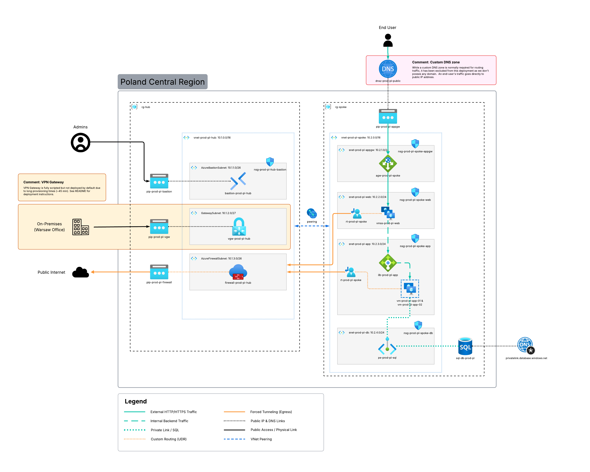

# azure-az104-sandbox
A ready-to-deploy lab environment designed to help you ace the AZ-104 certification exam.

## Table of Contents
* [Why this project?](#why-this-project)
* [Conceptual Diagram](#conceptual-diagram)
* [Key Features](#key-features)
* [Network Traffic Flow](#network-traffic-flow)
* [Tech Stack](#tech-stack)
* [Important: Budget Warning](#important-beware-of-your-budget)
* [Prerequisites](#prerequisites)
* [Secrets Management](#secrets-management)
* [Project Structure & Modules](#project-structure--modules)
* [How to Deploy](#how-to-deploy)
* [Customization (Quotas & Sizing)](#️-customization-regional-quotas--sizing)
* [How to verify the setup](#how-to-verify-the-setup)
* [Optional: Hybrid Connectivity (VPN)](#optional-hybrid-connectivity-vpn)

## Why this project?
I built this infrastructure while preparing for **AZ-104** and learning **Terraform**, mainly to have a place to practice. Now I’m sharing it with the community.

This environment is a sandbox to run exercises, test configurations, and get comfortable with Azure administration in a hands-on way.

The goal is to practice various scenarius, which is helpfull during AZ-104 exam and in real life while working with Azure.

## Conceputal Diagram



### Diagram Legend & Traffic Flows
* **Continuous Green:** **External HTTP/HTTPS Traffic** – User requests from the Internet to the Web Tier.
* **Dashed Green:** **Internal Backend Traffic** – Load-balanced communication between Web and App layers.
* **Dotted Teal:** **Private Link (SQL Access)** – Fully isolated database connectivity (Zero Public Access).
* **Dashed Orange:** **Traffic Steering (UDR)** – Logic forcing all traffic to the Firewall.
* **Continuous Orange:** **Inspected Egress** – Filtered outbound traffic leaving to the Internet.
* **Continuous Black:** **Management Ingress** – Secure entry points for Admins (Bastion) and VPN.
* **Dashed Blue:** **VNet Peering** – Private Azure backbone connecting Hub and Spoke.

## Resource Visualizer (Live Environment)
This is an automated export of the resources as they appear in the Azure Portal after a successful deployment. It shows the real-time complexity and naming conventions of the sandbox.


## Key Features

* **Hub & Spoke Achitecture**: Two peered VNets with isolated roles.
* **Hybrid Load Balancing**: A public **Application Gateway** for the Web layer and a private **Internal Load Balancer** for the App layer.
* **Traffic Control (UDR)**: Custom routing that forces all internet-bound traffic through the **Azure Firewall** for inspection.
* **Zero Public IPs on VMs**: All virtual machines are kept in private subnets. Access is managed strictly via **Azure Bastion**.
* **High Availability**: Resources are spread across multiple **Availability Zones** in the Poland Central region.
* **Modular Code**: Infrastructure is broken down into reusable modules, making it easy to scale or modify.

## Network Traffic Flow

This environment is built on a Hub & Spoke architecture, with traffic routing managed through the following paths:

### 1. Inbound Traffic (External)
The end user requests enter the system through the **Application Gateway's** Public IP. As a Layer 7 load balancer, it evaluates the traffic and routes it to the **Web Tier** (Virtual Machine Scale Set) located in the `snet-prod-pl-appgw` subnet.

### 2. Internal Communication
Communication between the Web and Application tiers is handled by an **Internal Load Balancer**. This ensures that requests are distributed efficiently across **App VMs** and provides redundancy across different Availability Zones.

### 3. Outbound Traffic and Management (Internal)
* **Centralized Inspection**: All outbound traffic from the Spoke network is redirected to the **Azure Firewall** in the Hub via **User-Defined Routes (UDR)**. This allows for centralized monitoring and traffic filtering.
* **Administrative Access**: Virtual Machines do not have public IP addresses. Secure management is performed through **Azure Bastion**, which provides an SSH tunnel without exposing the servers to the internet.
* **Connectivity**: The Hub and Spoke VNets communicate via **VNet Peering**, which allows resources to talk to each other across different networks.

## Tech Stack
* **Cloud:** Microsoft Azure
* **IaC:** Terraform
* **CLI:** Azure CLI & GitHub CLI

## Important: Beware of Your Budget!

Please be aware that hosting this infrastructure in Azure is not free. This project uses some "Enterprise-grade" resources to give you a real-world experience, and Microsoft charges for them by the hour.

### The Most Expensive Resources
* **Azure Firewall**: This is the most expensive part of the lab (roughly **$0.90/hr**).
* **Application Gateway & Bastion**: These are mid-range costs (about **$0.20 - $0.25/hr**). They are essential for the architecture, but they add up over time.
* **Virtual Machines**: These are relatively cheap (~**$0.05/hr**), but remember they still charge you as long as they exist.
* **Virtual Network Gateway (VPN)**: If you decide to enable the optional VPN module, be aware it is also quite expensive (starting at ~**$0.19/hr**). It is **disabled by default** to protect your credits.

### Tips:
1. **The "Golden Rule"**: Always run `terraform destroy` the moment you finish your practice session. Don't leave it for "tomorrow."
2. **Check your Portal**: After destroying, double-check the Azure Portal to make sure the Resource Group is actually empty.
3. **Use Free Credits**: If you are a student or on a trial, keep a close eye on your remaining balance in the Azure Cost Management dashboard.

## Prerequisites

### 1. Azure Account
You’ll need an active Azure subscription to follow along. 
* **If you're a student:** Use the [Azure for Students](https://azure.microsoft.com/free/students/) offer. You get $100 in credits and some free services without even needing a credit card.
* **Otherwise:** Grab a [Free Trial account](https://azure.microsoft.com/free/) with $200 credit.

### 2. Terraform
You’ll also need the Terraform CLI to deploy the infrastructure. You can find the official, step-by-step installation guide for your OS here:

**Installation Guide:** [Install Terraform CLI](https://developer.hashicorp.com/terraform/tutorials/aws-get-started/install-cli)

Once installed, verify it by running:
`terraform -version` in CLI.

## Secrets Management
To follow security best practices, sensitive data (passwords, VPN keys) is **not** stored in the main `terraform.tfvars` file.

### How to handle passwords:
1. Create a local file named `secret.tfvars` (this file is already ignored by git).
2. Copy the structure from `secret.tfvars.example`.
3. Fill in your own passwords.
4. Run terraform with the additional var-file flag:
   ```bash
   terraform plan -var-file="secret.tfvars"
   terraform apply -var-file="secret.tfvars"
   ```

## Project Structure & Modules

The project follows a modular architecture to ensure maintainability, reusability, and a clear separation of concerns.

### Reusable Modules (`/modules`)

* **`network/`**: The foundation of the lab. It handles dynamic VNet/Subnet creation, peering, and the **UDR (User Defined Routes)** logic to steer traffic.
* **`security/`**: Centralizes security resources, including **Azure Firewall** for traffic inspection and **Azure Bastion** for secure management.
* **`compute/`**: Contains blueprints for the workload layer, featuring **Linux VMs** for the App tier and **Virtual Machine Scale Sets (VMSS)** for the Web tier.
* **`load_balancing/`**: Manages traffic distribution via **Application Gateway** (External L7) and **Internal Load Balancer** (Internal L4).
* **`database/`**: Provisions **Azure SQL Database** with **Private Link** and Private DNS configurations for internal-only connectivity.
* **`network/vpn/`**: Provisions a **VPN Gateway**, Local Network Gateway, and Connection for Site-to-Site hybrid connectivity.

### Root Configuration

* **`main.tf`**: The entry point that initializes Resource Groups and orchestrates all module calls.
* **`network.tf` / `security.tf` / `compute.tf` / `loadbalancing.tf`**: These files act as high-level managers, passing necessary outputs (like Subnet IDs) between modules.
* **`outputs.tf`**: Defines the data displayed in the terminal after deployment, such as the **Application Gateway access link**.
* **`variables.tf`**: Declares all input variables (SKUs, naming, regions) used throughout the infrastructure.
* **`terraform.tfvars`**: Stores non-sensitive default values (e.g., location, instance types).
* **`secret.tfvars.example`**: A template for your local sensitive data (passwords, VPN shared keys).

## How to Deploy
Follow these steps:

1. **Authenticate:** Log in to your Azure account via CLI.
   `az login`
2. **Initialize:** Download the required Terraform providers and initialize the working directory.
   `terraform init`
3. **Plan:** Preview the resources that will be created.
   `terraform plan`
4. **Apply:** Deploy the infrastructure to your Azure subscription (you will be prompted to type `yes`).
   `terraform apply`

**Note: Don't forget to run `terraform destroy` when you're done practicing to avoid unnecessary cloud charges!*

## Customization (Regional Quotas & Sizing)

Depending on your Azure subscription type (e.g., Free Trial, Student), you might face **vCPU Quota limits** in certain regions. You can easily customize the deployment to fit your available quotas by modifying the `terraform.tfvars` file.

### Adjusting location and SKUs:
If you encounter a `QuotaExceeded` error, open `terraform.tfvars` and update the values:

```hcl
# Example configuration in terraform.tfvars
location             = "westeurope"      # Change to a region where you have available quota
vmss_size            = "Standard_B2s"    # Use smaller, cheaper instances if needed
app_server_size      = "Standard_B2s"    
storage_account_type = "Standard_LRS"
```

## How to verify the setup

Once Terraform finishes the deployment, you can run these simple tests to make sure everything is configured correctly:

### 1. Check the Web Entrance
Copy the **Public IP of the Application Gateway** (find it in the Azure Portal or via Terraform outputs) and paste it into your browser. You should see the default page of your Web VMs. This confirms the App Gateway and VMSS are talking to each other.

### 2. Test the Firewall
Log in to one of your VMs via **Azure Bastion**. Open the terminal and try to ping a public website or run `curl -I https://www.google.com`. 
* If it works: The traffic is successfully leaving the network.
* Advanced: Check the Firewall logs in the Portal to see your request being "allowed" and routed through the Hub.

### 3. Verify High Availability
In the Portal, manually stop one of your App VMs. Refresh the Application Gateway URL. The site should still be up because the **Internal Load Balancer** automatically shifted the traffic to the second, healthy VM.

### 4. Management Access
Try to connect to a VM using its private IP through the **Bastion** service. If you can get in without a Public IP assigned to the VM itself, your management plane is secure and working.

## Optional: Hybrid Connectivity (VPN)

This project includes a fully scripted **Site-to-Site VPN** module to simulate connecting an On-Premises office to your Azure environment. 

### Why is it disabled by default?
Provisioning an Azure VPN Gateway is a time-consuming process that typically takes **30 to 45 minutes**. To allow for quick testing of the core Hub & Spoke architecture, the VPN module is commented out by default.

### How to enable VPN:
1. Open the `vpn.tf` file in the root directory.
2. Uncomment the `module "vpn_gateway"` block.
3. In your peering configuration, ensure `use_remote_gateways` is set to `true` (see Troubleshooting below).
4. Provide your office public IP and shared key in `secret.tfvars`.

> **Troubleshooting Peering:** If you try to create a VNet Peering with the `UseRemoteGateway` flag set to `true` while the VPN Gateway is not deployed, Azure will return a `Bad Request` error. Only enable gateway transit in peering *after* or *during* the VPN Gateway deployment.